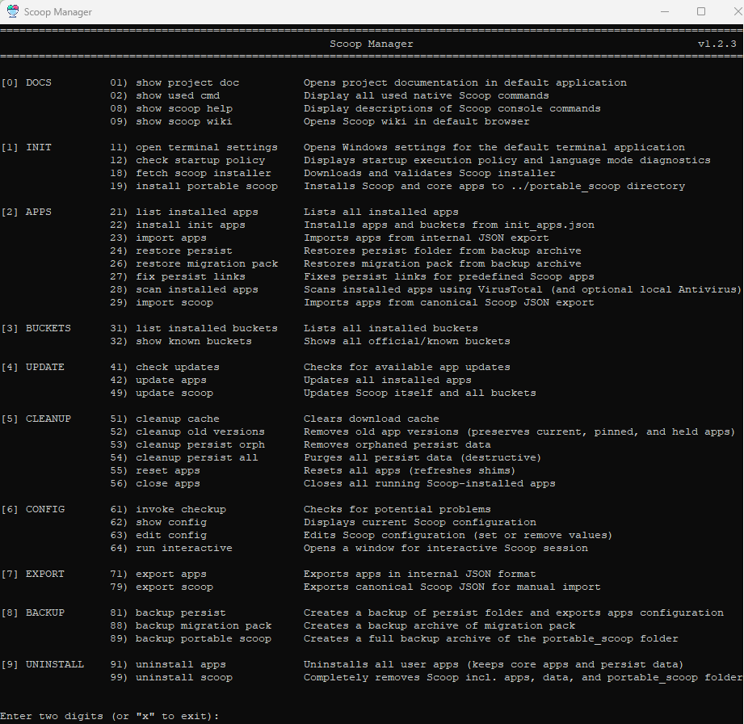
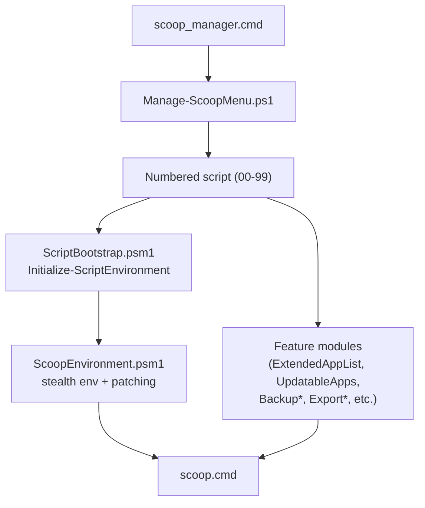

# Scoop Manager

   

<p align="center">
  
</p>

A production-ready CLI toolkit for managing portable [Scoop](https://scoop.sh/) installations on Windows, driven by an interactive numbered menu (`scoop_manager.cmd`). Designed for portable install, update, and migration of large app sets across machines — without admin rights and without persistent system changes (stealth mode).

---

## Purpose

This project enables you to:
- Install [Scoop](https://scoop.sh/) into a portable, relocatable directory.
- Define and version your app configuration via JSON.
- Export and import your entire Scoop setup between machines.
- Back up and restore apps, persist data, and migration packs.
- Run everything from a simple menu (`scoop_manager.cmd`), including in paths with spaces and leading hyphens.

---

## How It Works

<p align="center">
  
</p>

<p align="center"><sub>The numbered menu launched by <code>scoop_manager.cmd</code>.</sub></p>

- A batch launcher (`scoop_manager.cmd`) starts a numbered PowerShell menu (`Manage-ScoopMenu.ps1`) that drives every action — install, import, update, scan, backup, uninstall.
- Scripts are organized `00–99` by section (Docs, Init, Apps, Buckets, Update, Cleanup, Config, Export, Backup, Uninstall) and share a common bootstrap so each one starts from a known stealth environment.
- A patched Scoop installer redirects the install to a sibling `portable_scoop\` folder; environment variables (`SCOOP`, `SCOOP_CACHE`, `XDG_CONFIG_HOME`, `PATH`) are set for the process only — nothing persists in the user/system registry.
- A central VirusTotal gate runs before every managed install/update/import action and supports per-app `Continue / Skip / Abort`. An audit-only scanner (script 28) adds a Windows Defender pass for installed apps.
- Configuration lives in JSON: `config/manager_config.json` (manager behaviour), `config/apps/init_apps.json` (target app set), `config/persist_links.json` (relinks for apps that store data outside Scoop's `persist`).
- Migration is by export/import: a single `install_scoop\` + `portable_scoop\` pair plus an `export_apps_*.json` is enough to reproduce the setup on another machine.

> Scoop itself is an open-source project maintained by the Scoop community. See [scoop.sh](https://scoop.sh/) for more information.

---

## Tech Stack

- **Shell / runtime**: Windows PowerShell 5.1+, classic Windows Console Host, batch launcher (`.cmd`)
- **Package manager**: [Scoop](https://scoop.sh/) (patched installer in `patch/` for portable + stealth installs)
- **Configuration**: JSON (`config/*.json`) — versioned, machine-portable
- **Archiving / I/O**: built-in `Compress-Archive`, `robocopy`, hard-links / junctions / symlinks for persist relinking
- **Security**: VirusTotal API (via Scoop), optional Windows Defender (`MpCmdRun.exe`) integration
- **Project tooling**: Conventional Commits, `.editorconfig`, memory-bank pattern for long-term design notes

---

## Quick Start

### Fresh Installation

For a new PC or first-time setup:

1. **Run the menu launcher**
   ```cmd
   scoop_manager.cmd
   ```

2. **Execute scripts in sequence**
   - Type `11` - Open Settings (set classic console host, optional).
   - Type `18` - Fetch Scoop installer.
   - Type `19` - Install Scoop into `portable_scoop\` (stealth mode).
   - Type `22` - Install predefined apps from `config/apps/init_apps.json`.

### Clone Existing Setup

To replicate an existing Scoop configuration:

1. **Copy this folder** (`install_scoop`) to the new PC. Location does not matter — `portable_scoop\` will be created next to it on first run.
2. **Run the menu launcher**
   ```cmd
   scoop_manager.cmd
   ```
3. **Execute import workflow**
   - Type `11` - Open Settings (set classic console host, optional).
   - Type `18` - Fetch Scoop installer.
   - Type `19` - Install Scoop.
   - Type `23` - Import apps from the latest export JSON (script 71 output).

---

## Workflows

A few common script sequences. Use them as a starting point — every script can also be run standalone from the menu.

- **Fresh install** — 18, then 19, then 22
- **Clone / import** — 18, then 19, then 23 or 29, then 24 / 26 (restore persist / migration pack if needed)
- **Maintenance** — 41 (check updates), then 42 (update apps), then 49 (update Scoop), then 52 / 51 (cleanup)
- **Backup / restore** — 81 / 88 / 89 (create backups), then 24 / 26 / 29 (restore)
- **Uninstall** — 91 (remove user apps), then 99 (remove Scoop + portable_scoop)

Per-script behaviour and tables for Sections 0–9 are in [docs/SCRIPTS.md](docs/SCRIPTS.md).

---

## Folder Structure

The manager (`install_scoop/`) and its runtime target (`portable_scoop/`) share the same parent directory.

```text
<parent_dir>/
├── install_scoop/                            # This project (Scoop Manager)
│   ├── .github/
│   │   └── PULL_REQUEST_TEMPLATE.md          # PR template
│   ├── config/
│   │   ├── apps/
│   │   │   ├── init_apps.json                # Buckets + apps installed by script 22
│   │   │   └── init_apps_examples.json       # Reference example showing every option
│   │   ├── manager_config.json               # Manager behaviour (single source of truth)
│   │   ├── manager_config.local.example.json # Local-overrides template (secrets go here)
│   │   └── persist_links.json                # Relinks for apps storing data outside persist
│   ├── docs/
│   │   ├── assets/                           # README logo, screenshot, social card
│   │   ├── CONFIGURATION.md                  # Full config-key reference
│   │   ├── SCRIPTS.md                        # Script catalogue (Sections 0–9) + modules
│   │   └── SECURITY_GATES.md                 # VirusTotal + Defender flow
│   ├── memory-bank/                          # Long-term design docs (humans + AI)
│   ├── modules/                              # Shared PowerShell modules (.psm1)
│   ├── patch/                                # Scoop installer + lib patches
│   ├── scripts/                              # PowerShell scripts (organized 00–99)
│   ├── AGENTS.md                             # AI / contributor collaboration rules
│   ├── CHANGELOG.md                          # Version history
│   ├── CONTRIBUTING.md                       # Contribution workflow
│   ├── LICENSE                               # MIT License
│   ├── README.md                             # This file
│   ├── SECURITY.md                           # Disclosure policy and security scope
│   ├── scoop_manager.cmd                     # Interactive menu launcher
│   ├── .editorconfig                         # Editor defaults
│   ├── .gitattributes                        # Git text/binary attributes
│   └── .gitignore                            # Ignore rules
│
└── portable_scoop/                           # Scoop installation (created by script 19)
```

---

## Portable Installation Model

Scoop Manager keeps software inside a dedicated portable root (`portable_scoop\`) created next to the manager folder (`install_scoop\`), rather than scattering app installs across default Windows program locations.

`portable_scoop\` is created on first run by script `19_Install-PortableScoop.ps1`, which downloads Scoop (via the patched installer in `patch/`) and installs it into `..\portable_scoop` using process-scoped environment variables only (stealth mode — no system PATH or registry writes). Its layout follows the [standard Scoop folder structure](https://github.com/ScoopInstaller/Scoop/wiki) and owns everything Scoop needs at runtime:

```text
portable_scoop\
  apps\           # Installed applications (one folder per app, with versioned subfolders)
  buckets\        # Cloned Scoop manifest buckets (main, extras, nirsoft, ...)
  cache\          # Downloaded installer payloads (clearable via script 51)
  persist\        # Per-app persisted data (profiles, configs, user state)
  shims\          # Scoop-generated executables added to PATH (process-scoped)
  workspace\      # Scratch space used by some scripts/migrations
  config.json     # Native Scoop config (separate from manager_config.json)
```

Because everything app-related lives under this single root:

- Backup, migration, and uninstall are folder-level operations (no registry cleanup, no admin needed).
- The whole pair (`install_scoop\` + `portable_scoop\`) can be moved to a different drive or PC by copying the parent directory.
- In stealth mode, environment changes are confined to the running session, so the host machine is unchanged once the session ends.

---

## Configuration

Three JSON files under `config/` drive Scoop Manager's behaviour:

| File | Purpose |
|---|---|
| `config/manager_config.json` | Manager-level behaviour (logging, updates, VirusTotal, stealth, core apps). |
| `config/apps/init_apps.json` | Target app + bucket set installed by script 22 on a fresh installation. |
| `config/persist_links.json` | Relinks for apps that store data outside Scoop's `persist` folder. |

Local secrets (e.g. VirusTotal API key) belong in `config/manager_config.local.json` (gitignored) — see the committed [`config/manager_config.local.example.json`](config/manager_config.local.example.json).

For the full key reference, JSON schemas, and worked examples, see **[docs/CONFIGURATION.md](docs/CONFIGURATION.md)**.

---

## Security Gates

Every managed install / update / import runs a central **VirusTotal gate** before each app action. The gate blocks on `Risky`, `Skipped`, and `Error` statuses and prompts per-app `Continue / Skip / Abort`. Script `28_Scan-InstalledApps` is the audit-only counterpart and additionally runs **Windows Defender** (Detect-only) against each installed app and `persist\<app>` folder.

For setup, full gate flow, status semantics, and Defender integration, see **[docs/SECURITY_GATES.md](docs/SECURITY_GATES.md)**.

---

## Architecture Overview

Scripts in `scripts/` are organized `00–99` by section (Docs, Init, Apps, Buckets, Update, Cleanup, Config, Export, Backup, Uninstall) and orchestrated by the menu manager `Manage-ScoopMenu.ps1`. Shared behaviour — stealth environment bootstrap, console UI, process logging, persist relinking — lives in `modules/*.psm1` and is consumed by every script through a single bootstrap call.



For the full script catalogue and module list, see **[docs/SCRIPTS.md](docs/SCRIPTS.md)**.

For deeper architecture, design patterns, and decisions, see:
- `memory-bank/systemPatterns.md`
- `memory-bank/techContext.md`
- `memory-bank/technicalDetails.md`
- `memory-bank/productContext.md`

---

## Troubleshooting

### Windows Terminal vs classic console

Scoop Manager is designed for Windows Console Host (classic console) so it can control the window icon and related UI behavior.
If you want the Scoop icon, set `Default terminal application` to `Windows Console Host` (you can run script `11_Open-TerminalSettings.ps1` to open the right Settings page).

### PowerShell Execution Policy

If scripts fail to load (`running scripts is disabled`):

- Prefer launching via `scoop_manager.cmd` (it uses process-scoped `-ExecutionPolicy Bypass`).
- If you still see policy errors on a managed/locked-down machine, policy may be enforced by WDAC/AppLocker/CLM or Group Policy.

On personal machines you can also set a user-scoped policy:

```powershell
Set-ExecutionPolicy -Scope CurrentUser -ExecutionPolicy RemoteSigned
```

The `scoop_manager.cmd` launcher uses `-ExecutionPolicy Bypass` for its own session (process-scoped only), but policy controls (WDAC/AppLocker/CLM) can still block scripts in some environments.

### PATH / "Scoop not found"

- Ensure `portable_scoop\` exists next to `install_scoop\`.
- Ensure `portable_scoop\shims\scoop.cmd` exists.
- Rerun script `19_Install-PortableScoop.ps1` if installation failed.

### Mark of the Web (downloaded ZIPs)

If you unzip this project from a downloaded ZIP, Windows may mark extracted files as "from the internet".
If you see script blocking prompts/errors, unblock the ZIP before extracting or re-extract after unblocking.

---

## Reference Docs

- **[docs/SCRIPTS.md](docs/SCRIPTS.md)** — full script catalogue (Sections 0–9) and module list.
- **[docs/CONFIGURATION.md](docs/CONFIGURATION.md)** — `manager_config.json` keys, `init_apps.json` schema, persist-links rules.
- **[docs/SECURITY_GATES.md](docs/SECURITY_GATES.md)** — VirusTotal gate flow and Windows Defender audit integration.
- **[CHANGELOG.md](CHANGELOG.md)** — release notes and version history.
- **[CONTRIBUTING.md](CONTRIBUTING.md)** — contributor workflow and quality expectations.
- **[SECURITY.md](SECURITY.md)** — disclosure policy and security scope.
- **[AGENTS.md](AGENTS.md)** — AI/contributor collaboration guardrails and memory-bank policy.
- `memory-bank/*.md` — long-term architecture, design decisions, and product context.

---

## Contributing

This project started as a personal toolkit, but contributions and adaptations are welcome.
The folder methodology, stealth mode, and script patterns can be reused in other portable app scenarios.
For contribution workflow and quality expectations, see [CONTRIBUTING.md](CONTRIBUTING.md).

## License

Released under the MIT license — provided as-is. See [LICENSE](LICENSE).
